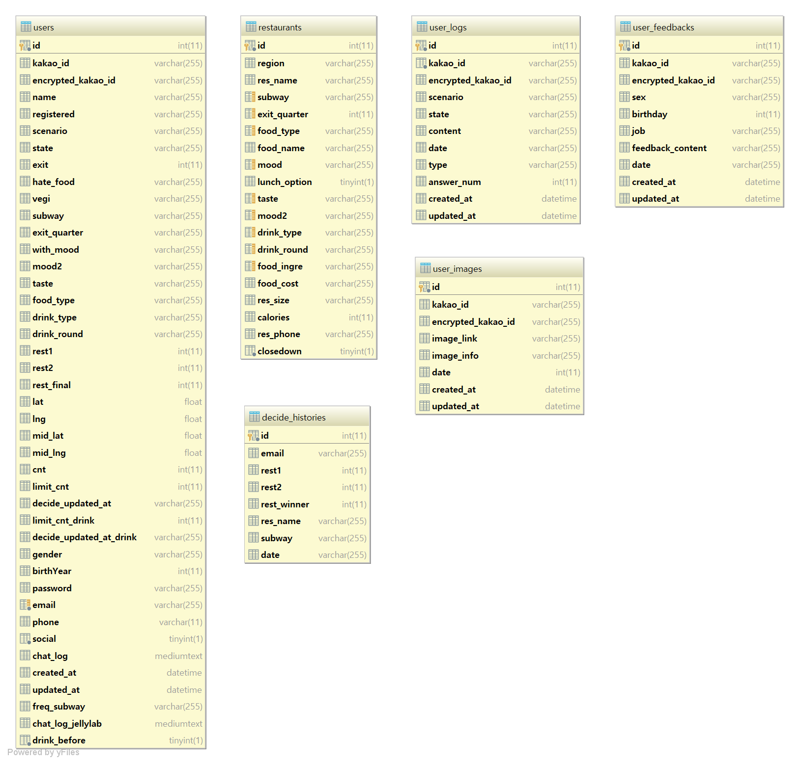

# food-api-server

food-chatbot에 이용되는 API들을 관리하는 서버. ORM으로 Sequelize를 사용하였다.

### 모델

2018/12/28 기준

기존에 카카오톡 플랫폼 기반에서 작동되던 DB를 그대로 사용하고 있어서, User 테이블에서 미사용 칼럼들이 많다.

웹 챗봇의 가장 중요한 요소인 socket id는, kakao_id 칼럼에 저장된다.

**verifyAPIKEY**

- API 요청이 왔을 때, API-KEY를 검사해서 사용가능 여부를 판단하게 한다.
  - 현재는 개발 단계이기 때문에, 사용하지 않음.

### 주요 API

**updateUser**

- POST방식으로 넘어온 body에 따라, User 테이블의 칼럼들을 Update 하는 API 이다.

**getRestaurant**

- food-chatbot의 마지막 시나리오에 사용되는 주 API로서, 사용자가 선택한 조건에 따라, 알맞은 음식점 두 곳을 선택해준다.
- - FULL-TEXT-SEARCH 방식으로 쿼리를 작성하였으며, 시나리오상의 **'상관없음'**, **'~ 빼고'** 를 선택한 경우를 고려하여 각 쿼리문 앞에 NOT을 판단하는 변수를 두어, 예외처리를 할 수 있게 하였다.
- 만약 첫번째  쿼리에서 결과가 2개가 안나올 시, 출구(exit_quarter)를 전체로 두고 다시 검색해서 결과를 return 한다.
- **try** 값으로, 첫 번째 만에 2곳이 나왔는지, 두 번째에 2곳이 나왔는지를 구분한다.

**updateSocket**

- 사용자의 접속 종료와, 접속 끊김을 대비하여, 로그인에 따른 시나리오 유지를 위한 API. 
- 접속 때마다 웹소켓은 매번 변경되므로, 새로 접속 시 인식된 웹소켓을 User 테이블에 업데이트시켜준다.
- **getChatLog 의 접속 끊김/종료 판단을 위해, silent 옵션을 적용하여 updated_at timestamp에 영향을 주지 않게 하였다.**

**updateChatLog**

- 재접속 시, 이전에 대화한 기록을 불러오기 위한 채팅기록을 통채로 저장하는 API로서, 매번 채팅마다 사용된다. 너무 많은 기록 저장을 지양하기 위해, html의 String Length 기준으로 1000000 이상일 시, 초기화 된다.

**createDecideHistory**

- 사용자가 음식점 최종 선택을 할 때, 그 기록을 저장하는 API로서, 최종후보 2곳, 우승 음식점 이름, 지하철역, 선택 날짜를 년도-달-일 로 저장시킨다.

**createUserFeedback**

- **'개발팀에게 피드백하기'** 시나리오에서 사용하는 API로서, 사용자의 피드백을 DB에 저장시킨다. 익명성을 위해, 소켓번호, 성별, 생일, 직업, 날짜만 저장시킨다.(18/12/28 기준으로 성별, 생일, 직업을 회원가입시 받지 않으므로, 공란으로 비워두었다.)

**createUserLog**

- 사용자의 대화 로그를 하나 씩 기록하는 API, 봇이 한 말은 id가 foodle로 저장된다.

**updateLimitCnt**

기본값 0에서, '메뉴 고르기' 시나리오를 수행할 때 마다, 조건에 따라 1씩 증가시키는 API

>verifyLimit 참고

- 요청된 limit_cnt가 1인 경우
- - 처음 시작하는 경우이므로, decide_updated_at을 현재 시간으로 함께 업데이트 시킨다.
- 요청된 limit_cnt가 1이 아닌 경우
- - 처음 시작하는 경우가 아니므로, limit_cnt만 업데이트 시킨다.

**verifyLimit**

- food-chatbot은 '메뉴 고르기' 를 30분 당 5번만 이용할 수 있다. 그 여부를 판단하는 API
- User 테이블의 limit_cnt와, decided_updated_at 칼럼을 이용해서 여부를 판단한다.

  - limit_cnt의 기본값은 0으로, 한번 '메뉴 고르기' 시나리오를 수행할 때 마다, updateLimitCnt API의 조건에 따라 1씩 증가하고, 조건에 따라 decided_updated_at가 업데이트된다.(moment 모듈 사용)

  - >updateLimitCnt 참고
- 판별 경우의 수

- - 음식점 선택 횟수(limit_cnt)가 5일때
  - - 마지막 선택 시간으로부터 30분이 지나면,
    - - 음식점 선택 횟수(limit_cnt)를 0으로 초기화하고 시나리오 진행 가능(success)
    - 마지막 선택 시간으로부터 30분이 지나지 않았으면,
    - - 시나리오 진행 불가(failed)
  - 음식점 선택 횟수(limit_cnt)가 5가 아닐 때,
  - - 마지막 선택 시간으로부터 30분이 지나면,

    - - 음식점 선택 횟수를 0으로 초기화하고 시나리오 진행 가능(success)

      - > 이전 30분에 대한 조건은 끝났으므로, 다시 30분을 카운트 하기 위함.

    - 마지막 선택 시간으로부터 30분이 지나지 않았으면,

    - - 시나리오 진행 가능(success)

**updateState**

- 시나리오의 flow를 담당하는, User 테이블의 scenario, state 칼럼을 같이 업데이트 시키는 API

**getAllSubway**

- 지하철 선택의 자동완성을 담당하는 API 
- 사용자가 문자를 입력할 때 마다, term이 query 값으로 넘어오게 된다.
- 이 query값과, 현재 restaurant 테이블의 모든 subway 칼럼을 검색해서 비교를 한 후, 알맞은 결과 값을 배열로 return 한다.
- Hangul.js를 이용해서, term이 초성으로 넘어와도 똑같이 검색이 가능하게 하였다.

>정식버젼이 아닌, 유저가 수정한 버젼을 사용하였다.
>
>Hangul.js 초성 검색 가능 버젼
>
><https://github.com/g1s/Hangul.js>

**verifySubway**

- 사용자의 지하철 선택 입력을 받아서, DB내에 존재하는 지하철 여부임을 판단하는 API

**crawlImage**

- 음식점 이름을 받아서, 네이버 검색을 통해 이미지를 크롤링 하는 API

**getChatLog**

- 사용자의 통채로 저장된 채팅기록을 가져오는 API, 동시에 접속 종료와 접속 끊김에 대한 판별도 수행한다.
- - 현재 시간과 사용자의 마지막 기록 시간을 비교하여, 차이가 10분 이상일시, 접속 종료로 판단하고, 새 시나리오 시작을 위해, scenario와 state을 100, init으로 업데이트 한다.(disconn_type: 'permanent' return)
- - 차이가 10분 이하일시 접속 끊김으로 판단하고, 이전 시나리오에서 이어서 진행하게 한다.(disconn_type: 'temporary' return)

**getSubwayListHistory**

- 지하철 선택의 자동완성에서, 유저가 아무것도 입력하지 않았을 때, 기본 자동완성으로 유저의 최근 지하철 선택 기록을 보여주는 API
- Decide_history 테이블에서 사용자에 따른 지하철 검색 기록과 날짜를 불러온 후, 마지막 5개를 배열에 담아서 return 한다.(동일 지하철은 최신 날짜 하나만 선택)

### 새로운 API 추가하기

1. **[server/services/users/](./server/services/users/)**에 새로운 API 모듈 추가하기
2. **[server/controllers/apis/users/index.js](./server/controllers/apis/users/index.js)**에 라우터 설정

### TODO?

- 기존 카카오톡 기반 플랫폼과 달리 웹 기반이기 때문에, 세션처리가 용이하다.  
- 꼭 필요한 정보 아니면, 세션으로 처리해서 칼럼을 줄이는 게 더 효율적이라고 생각한다.